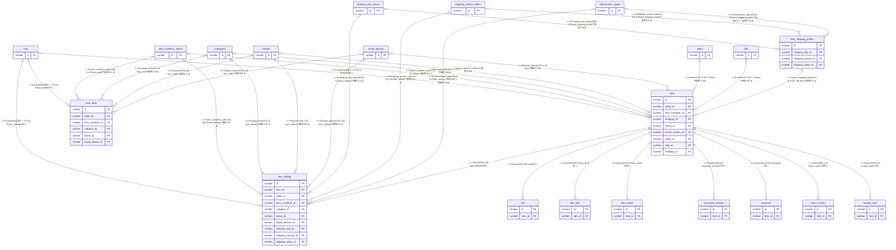

# 商品系DB ER図

```mermaid
erDiagram

user {
    number id PK
}

item_condition_option {
    number id PK
}

categories {
    number id PK
}

brands {
    number id PK
}

brand_aliases {
    number id PK
}

shipping_day_option {
    number id PK
}

shipping_service_option {
    number id PK
}

todouhuken_option {
    number id PK
}

video {
    number id PK
}

sale {
    number id PK
}

item_shipping_profile {
    number id PK
    number shipping_day_id FK
    number shipping_service_id FK
    number shipping_place_id FK
}

item {
    number id PK
    number seller_id FK
    number item_condition_id FK
    number category_id FK
    number brand_id FK
    number brand_aliases_id FK
    number video_id FK
    number sale_id FK
    number shipping_id FK
}

item_draft {
    number id PK
    number seller_id FK
    number item_condition_id FK
    number category_id FK
    number brand_id FK
    number brand_aliases_id FK
}

item_editing {
    number id PK
    number item_id FK
    number seller_id FK
    number item_condition_id FK
    number category_id FK
    number brand_id FK
    number brand_aliases_id FK
    number shipping_day_id FK
    number shipping_service_id FK
    number shipping_place_id FK
}

cart {
    number id PK
    number item_id FK
}

item_like {
    number id PK
    number item_id FK
}

item_report {
    number id PK
    number item_id FK
}

purchase_session {
    number id PK
    number item_id FK
}

comment {
    number id PK
    number item_id FK
}

watch_history {
    number id PK
    number item_id FK
}

coupon_item {
    number id PK
    number item_id FK
}

user o|--o{ item : "1人のuserは出品者として0以上のitemを持つ"

user o|--o{ item_draft : "1人のuserは出品者として0以上のitem_draftを持つ"

user o|--o{ item_editing : "1人のuserは出品者として0以上のitem_editingを持つ"

item_condition_option o|--o{ item : "1つのitem_condition_optionは0以上のitemで使用される"

item_condition_option o|--o{ item_draft : "1つのitem_condition_optionは0以上のitem_draftで使用される"

item_condition_option o|--o{ item_editing : "1つのitem_condition_optionは0以上のitem_editingで使用される"

categories o|--o{ item : "1つのcategoriesは0以上のitemで使用される"

categories o|--o{ item_draft : "1つのcategoriesは0以上のitem_draftで使用される"

categories o|--o{ item_editing : "1つのcategoriesは0以上のitem_editingで使用される"

brands o|--o{ item : "1つのbrandsは0以上のitemで使用される"

brands o|--o{ item_draft : "1つのbrandsは0以上のitem_draftで使用される"

brands o|--o{ item_editing : "1つのbrandsは0以上のitem_editingで使用される"

brand_aliases o|--o{ item : "1つのbrand_aliasesは0以上のitemで使用される"

brand_aliases o|--o{ item_draft : "1つのbrand_aliasesは0以上のitem_draftで使用される"

brand_aliases o|--o{ item_editing : "1つのbrand_aliasesは0以上のitem_editingで使用される"

shipping_day_option o|--o{ item_shipping_profile : "1つのshipping_day_optionは0以上のitem_shipping_profileで使用される"

shipping_day_option o|--o{ item_editing : "1つのshipping_day_optionは0以上のitem_editingで使用される"

shipping_service_option o|--o{ item_shipping_profile : "1つのshipping_service_optionは0以上のitem_shipping_profileで使用される"

shipping_service_option o|--o{ item_editing : "1つのshipping_service_optionは0以上のitem_editingで使用される"

todouhuken_option o|--o{ item_shipping_profile : "1つのtodouhuken_optionは0以上のitem_shipping_profileで発送元として使用される"

todouhuken_option o|--o{ item_editing : "1つのtodouhuken_optionは0以上のitem_editingで発送元として使用される"

video o|--o| item : "1つのvideoは0または1つのitemで使用される"

sale o|--o| item : "1つのsaleは0または1つのitemで使用される"

item_shipping_profile o|--o| item : "1つのitem_shipping_profileは0または1つのitemで使用される"

item ||--o{ item_editing : "1つのitemは0以上のitem_editingを持つ"

item ||--o{ cart : "1つのitemは0以上のcartを持つ"

item ||--o{ item_like : "1つのitemは0以上のitem_likeを持つ"

item ||--o{ item_report : "1つのitemは0以上のitem_reportを持つ"

item ||--o{ purchase_session : "1つのitemは0以上のpurchase_sessionを持つ"

item ||--o{ comment : "1つのitemは0以上のcommentを持つ"

item ||--o{ watch_history : "1つのitemは0以上のwatch_historyを持つ"

item ||--o{ coupon_item : "1つのitemは0以上のcoupon_itemを持つ"

```
