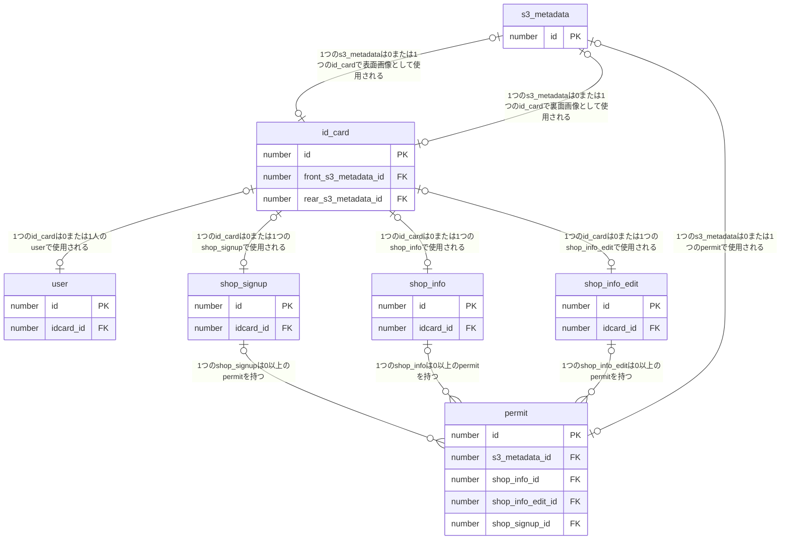

# s3_metadataを中心としたid_card・permit ER図

```mermaid
erDiagram

s3_metadata {
    number id PK
}

id_card {
    number id PK
    number front_s3_metadata_id FK
    number rear_s3_metadata_id FK
}

permit {
    number id PK
    number s3_metadata_id FK
    number shop_info_id FK
    number shop_info_edit_id FK
    number shop_signup_id FK
}

user {
    number id PK
    number idcard_id FK
}

shop_signup {
    number id PK
    number idcard_id FK
}

shop_info {
    number id PK
    number idcard_id FK
}

shop_info_edit {
    number id PK
    number idcard_id FK
}

s3_metadata o|--o| id_card : "1つのs3_metadataは0または1つのid_cardで表面画像として使用される"

s3_metadata o|--o| id_card : "1つのs3_metadataは0または1つのid_cardで裏面画像として使用される"

s3_metadata o|--o| permit : "1つのs3_metadataは0または1つのpermitで使用される"

id_card o|--o| user : "1つのid_cardは0または1人のuserで使用される"

id_card o|--o| shop_signup : "1つのid_cardは0または1つのshop_signupで使用される"

id_card o|--o| shop_info : "1つのid_cardは0または1つのshop_infoで使用される"

id_card o|--o| shop_info_edit : "1つのid_cardは0または1つのshop_info_editで使用される"

shop_info o|--o{ permit : "1つのshop_infoは0以上のpermitを持つ"

shop_signup o|--o{ permit : "1つのshop_signupは0以上のpermitを持つ"

shop_info_edit o|--o{ permit : "1つのshop_info_editは0以上のpermitを持つ"
```
